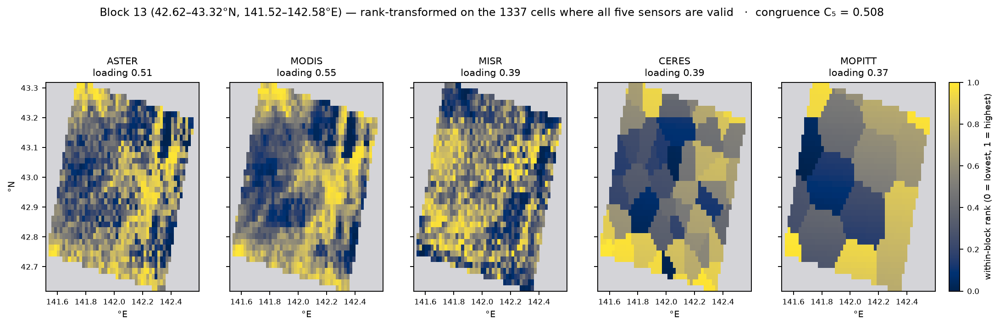
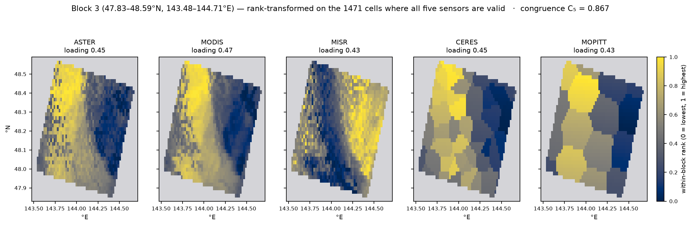

# Terra Fusion 5-sensor discrepancy, part 13: block 13 against reanalysis — congruence tracks scene contrast, and block 13 is still anomalous

Run on **ares**, 2026-09-29. Tests the remaining branch of CLAUDE.md's question
— *interesting weather* — by comparing the block ranking against data from
outside the granule: NCEP/NCAR Reanalysis 1 at the analysis time nearest the
overpass.

## Headline

* **The synoptic setting is an early-winter cold-air outbreak**: 1025 hPa over
  the continent, a 1003 hPa low northeast over the Okhotsk/Kuriles, strong
  northwesterly flow across Japan.
* **Congruence rises with thermal gradient — the opposite of the premise.**
  ρ(|∇T|, C₅) = **+0.867, p = 0.001** on cell-averages. The *most* congruent
  blocks sit in the *strongest* baroclinic zone. Low congruence is not
  "interesting weather"; it looks like weak scene contrast.
* **Block 13 is nevertheless a real outlier.** After controlling for thermal
  gradient its residual is **z = −2.81**, the most negative of 32 and nearly
  double the next (−0.245 vs −0.131).
* **Its dip is sub-grid-scale.** Blocks 11, 12 and 13 draw the *same*
  reanalysis cell and the same |∇T| = 1.93 K/100 km, yet C₅ = 0.685, 0.652,
  **0.508**.
* **Not explained** by land fraction, elevation or terrain roughness at this
  resolution.

## The resolution caveat, stated first

R1 is a **2.5° grid** — about 275 km. An ASTER block is 0.7° × 1.0°, about
70 km. **A block is smaller than one grid cell.** The 32 blocks span 17° of
latitude along a single track and fall into just **10 distinct cells**.

So an n = 32 correlation has nowhere near 32 independent samples. Every
correlation below is reported twice: once per block (inflated) and once over
cell-averages (honest). Only one relationship survives the second form.

| variable | ρ (block, n=32) | p | ρ (cell-avg, n=10) | p |
| --- | --- | --- | --- | --- |
| **air_grad** \|∇T\| | +0.430 | 0.014 | **+0.867** | **0.001** |
| slp | −0.387 | 0.028 | −0.479 | 0.162 |
| slp_grad \|∇P\| | +0.429 | 0.014 | +0.200 | 0.580 |
| air | −0.299 | 0.097 | −0.236 | 0.511 |
| pr_wtr | −0.247 | 0.173 | −0.152 | 0.676 |
| wspd | +0.277 | 0.124 | +0.406 | 0.244 |

The SLP and pressure-gradient relationships **do not survive aggregation** and
should not be cited. The thermal gradient one gets *stronger*, which is the
signature of a real relationship rather than an artifact of oversampling.

## Setting

Reanalysis slice **2001-11-18 00Z**; the overpass is 01:05Z, 65 minutes later.

```
SLP (hPa), 00Z 2001-11-18
        130.0  135.0  140.0  145.0  150.0  155.0
 50.0N 1021.4 1021.4 1017.7 1011.3 1004.9 1003.3
 45.0N 1024.4 1020.1 1014.4 1012.7 1008.0 1004.8
 40.0N 1023.8 1021.9 1018.6 1015.2 1012.1 1007.1
 35.0N 1023.3 1021.3 1018.6 1015.9 1012.9 1009.8
 30.0N 1020.6 1017.3 1014.0 1013.7 1013.6 1013.4
```

A continental high to the west, a deep low to the northeast, and a 20 hPa drop
across the domain — the classic Japan-in-November cold-air outbreak, with
northwesterly flow off the continent across the Sea of Japan.

## The main finding: congruence tracks contrast, not disturbance

| | blk | lat | C₅ | \|∇P\| | T °C | \|∇T\| | PW | wspd |
| --- | --- | --- | --- | --- | --- | --- | --- | --- |
| **least congruent** | 13 | 43.0 | 0.508 | 0.89 | 3.3 | 1.93 | 7.5 | 4.9 |
| | 26 | 36.1 | 0.535 | 0.40 | 8.2 | **0.69** | 9.8 | 4.1 |
| | 10 | 44.5 | 0.558 | 0.43 | 1.7 | 0.90 | 8.1 | 1.4 |
| | 20 | 39.3 | 0.594 | 1.19 | 6.3 | 0.47 | 8.1 | 6.6 |
| | 17 | 40.9 | 0.598 | 1.04 | 5.5 | 1.07 | 7.7 | 7.3 |
| **most congruent** | 6 | 46.6 | 0.835 | 1.22 | −0.2 | 1.61 | 7.1 | 5.6 |
| | 0 | 49.8 | 0.835 | 1.81 | −1.0 | **2.20** | 6.7 | 9.1 |
| | 2 | 48.7 | 0.851 | 1.77 | −1.0 | 2.15 | 6.6 | 8.4 |
| | 7 | 46.1 | 0.858 | 1.21 | 0.3 | 1.60 | 7.4 | 4.4 |
| | 3 | 48.2 | 0.867 | 1.76 | −1.0 | 2.13 | 6.6 | 8.0 |

*(|∇P| hPa/100 km, |∇T| K/100 km, PW kg/m², wspd m/s)*

The blocks where the five sensors **agree most** are in the coldest air with the
**strongest** thermal and pressure gradients and the highest winds — the heart
of the outbreak. The blocks where they agree least are warmer, weaker-gradient,
moister scenes to the south.

This inverts CLAUDE.md's premise. A strong baroclinic zone imprints a large,
spatially coherent radiance pattern that every instrument resolves regardless of
band, so the common mode is strong and C₅ is high. A bland scene has little
shared structure to find, so each sensor's field is dominated by its own
band-specific detail and noise, and C₅ is low.

**So C₅ is, to first order, a scene-contrast / signal-to-noise measure.** Low
congruence flags a *featureless* scene at least as readily as a disturbed one.
That is the third time in this series the metric has turned out to measure
something other than what it was read as — after part 10 (band selection) and
part 12 (spectral similarity).

## Block 13 survives the control

Fitting C₅ = 0.0697·|∇T| + 0.6182 (Pearson r = +0.429) and ranking the
residuals:

| blk | lat | \|∇T\| | C₅ | predicted | residual |
| --- | --- | --- | --- | --- | --- |
| **13** | 43.0 | 1.93 | 0.508 | 0.753 | **−0.245** |
| 26 | 36.1 | 0.69 | 0.535 | 0.666 | −0.131 |
| 10 | 44.5 | 0.90 | 0.558 | 0.681 | −0.124 |
| 12 | 43.5 | 1.93 | 0.652 | 0.753 | −0.100 |
| 17 | 40.9 | 1.07 | 0.598 | 0.693 | −0.095 |

Block 13's residual **z = −2.81**, rank 1 of 32, and is nearly twice the next
worst. It is not merely the lowest C₅ — it is far lower than its own synoptic
environment predicts.

### The dip is below the reanalysis's resolution

Blocks 11, 12 and 13 fall in the **same 2.5° cell** and carry the identical
|∇T| = 1.93:

| blk | lat | C₅ | \|∇T\| | gap | loadings |
| --- | --- | --- | --- | --- | --- |
| 11 | 44.0 | 0.685 | 1.93 | 0.17 | MODI=0.51 ASTE=0.49 CERE=0.47 MOPI=0.41 MISR=0.34 |
| 12 | 43.5 | 0.652 | 1.93 | 0.17 | MODI=0.51 ASTE=0.48 CERE=0.46 MOPI=0.42 MISR=0.34 |
| **13** | **43.0** | **0.508** | 1.93 | 0.18 | MODI=0.55 ASTE=0.51 MISR=0.39 CERE=0.39 MOPI=0.37 |
| 14 | 42.4 | 0.773 | 1.08 | 0.08 | MODI=0.49 ASTE=0.46 MISR=0.45 CERE=0.42 MOPI=0.41 |

A 0.14-0.27 drop between adjacent 70 km blocks inside one 275 km cell. **Whatever
distinguishes block 13 is a sub-grid-scale feature that this reanalysis cannot
see.** Its loading profile stays balanced (gap 0.18, no single weak sensor),
which under part 4's reading is the signature of real structure that all five
sensors partly resolve rather than one instrument failing.

### Terrain does not explain it

Block 13 is central Hokkaido (42.62-43.32°N, 141.52-142.58°E) — mountainous,
coastal, and at 10:05 local time in mid-November plausibly early-snow-covered.
Testing that with R1's land mask and orography:

| proxy | ρ with C₅ (n=32) | p |
| --- | --- | --- |
| land fraction | −0.327 | 0.067 |
| elevation | −0.382 | 0.031 |
| elevation roughness | −0.217 | 0.234 |

All marginal even at the *inflated* n, and the counterexamples are decisive:
block 7 is fully land-covered and the **second-most** congruent block, while
block 26 is over water and the **second-least**. At 2.5° the land mask is a
crude binary over a 275 km cell, so it cannot characterise a 70 km block
regardless. **Terrain is neither supported nor excluded — it is untested.**

## Verdict on CLAUDE.md's question

| branch | status for this orbit |
| --- | --- |
| processing error | **closed** by parts 10-12 — every sensor anomaly was band selection or correct physics |
| interesting weather | **not supported as the general driver**: congruence *rises* with synoptic activity |
| block 13 specifically | **confirmed anomalous** relative to its synoptic environment; cause unresolved |

The honest summary is that the block ranking is mostly explained by how much
contrast a scene has, and that block 13 is the one block this explanation
fails on. It is a genuine, localised, balanced-profile anomaly — which is the
most interesting thing the series has found — but **the claim that it is a
weather feature is still unconfirmed**, and nothing here should be read as
confirming it.

## The block, rendered



*All five on the common rank scale, restricted to the 1337 cells where every
sensor is valid — the exact matrix the congruence eigen-decomposition sees.
Per-sensor images in native units are in [`img/`](../img/): `tf_blk13_ASTER.png`
and the four siblings.*

Three things are visible that the numbers state but do not show:

* **ASTER and MODIS are near-duplicates.** Same fine structure, consistent with
  their median |ρ| of 0.925. ~~The scene is terrain-dominated — cold ridges, warm
  valleys, the Hidaka/Yubari relief of central Hokkaido — not a cloud field.~~
  **CORRECTED in
  [part 14](20260929_claude_terra_fusion_discrepancy_14_modis_16band.md): this
  is a cloud field.** BT₃₁ = 257.4 K is far too cold for clear land at 43°N in
  November, and BTD(20−31) = +34.4 K is a water-cloud solar-reflection
  signature. The ridge-and-valley appearance is cloud-top structure, plausibly
  organised by the terrain beneath but that is untested. The sentence above was
  written from visual impression without checking the bands, which were
  available.
* **MISR is close to the photographic negative of them.** Where the thermal
  sensors are bright, MISR red is dark. That is the reflective-vs-thermal
  anticorrelation sign alignment is designed to absorb, and it is why MISR still
  loads 0.39 rather than near zero. But the inversion is not clean at fine
  scale, and the residual is real disagreement.
* **CERES and MOPITT are visibly piecewise-constant** — nearest-neighbour
  Voronoi patches from 60 and 17 footprints. They cannot express the terrain
  structure the other three resolve, whatever their spectral match.

### The congruent end, for contrast



Block 3 (47.83-48.59°N, 143.48-144.71°E, over the Sea of Okhotsk) is the *most*
congruent block in the orbit, C₅ = 0.867 against block 13's 0.508. Rendered the
same way, the difference is obvious and it is the mechanism part 13 argues for:

* **One large-amplitude pattern spans the whole block** — bright west, dark east
  — and *all four* thermal-ish sensors reproduce it, MISR cleanly inverting it.
* **Even CERES and MOPITT recover it.** They are still coarse Voronoi patches,
  but a west-east gradient is something 60 and 17 footprints *can* express. In
  block 13 the structure is terrain-scale, which they cannot.
* **The loadings collapse together**: 0.47 / 0.45 / 0.45 / 0.43 / 0.43,
  `load_gap` **0.04**, against block 13's 0.55 / 0.51 / 0.39 / 0.39 / 0.37 and
  gap 0.18.

| | block 3 | block 13 |
| --- | --- | --- |
| C₅ | **0.867** | **0.508** |
| Kendall W | 0.848 | 0.490 |
| load_gap | 0.04 | 0.18 |
| \|∇T\| K/100 km | 2.13 | 1.93 |
| T °C | −1.0 | +3.3 |
| wind m/s | 8.0 | 4.9 |
| surface | ocean, −10 m | land, 132 m |

The two blocks sit in a comparable thermal gradient (2.13 vs 1.93), so the
difference is **not** synoptic forcing. What differs is what the scene is made
of: a single ocean-scale radiance boundary that every instrument resolves,
versus terrain structure that only the 1 km sensors can see. That is the
scene-contrast mechanism stated concretely — and it is also why block 13 is a
residual outlier rather than simply a quiet block.

These images show structure at a scale the 2.5° reanalysis cannot represent,
which is consistent with the sub-grid anomaly. What they do **not** do is
identify what the structure is — and the terrain reading first drawn from them
was wrong. See
[part 14](20260929_claude_terra_fusion_discrepancy_14_modis_16band.md), which
identifies the scene from MODIS's 16 emissive bands as a uniform water-cloud
deck and accounts for most of block 13's residual by its lack of thermal
contrast (z = −2.81 → −1.43).

## What would settle it

* **ERA5 at 0.25°** (~3 × 4 cells per block, hourly, so the 01:05Z overpass is
  matched directly rather than at +65 min). Requires CDS API credentials, which
  this environment does not have.
* **A cloud product** — MODIS MOD35/MOD06 for the same granule — would show
  directly whether block 13 sits on a cloud edge or a clear/cloud boundary,
  which is the most likely sub-grid explanation for five sensors partly
  disagreeing while none of them fails.
* **A DEM at ~1 km** to test the terrain hypothesis properly.

## Caveats

* **32 blocks, 10 independent cells.** Every n=32 p-value above is inflated;
  only |∇T| survives cell-averaging, and only that one should be cited.
* Reanalysis is 00Z, the overpass 01:05Z — 65 minutes of drift, during which a
  cold-air outbreak's cloud field moves appreciably.
* R1 is a coarse, 1990s-vintage product. The synoptic *pattern* is reliable; the
  gradient magnitudes at a specific point are not precise.
* The C₅-vs-|∇T| relationship is correlational over one orbit and one time. The
  scene-contrast interpretation is a reading of it, not a demonstrated
  mechanism.
* Latitude was checked as a confound and is **not** driving the ranking
  (ρ = +0.283, p = 0.12); block 31 at 33.5°N is among the most congruent.
* One orbit, as throughout parts 10-13.

## Reproducing

```sh
cd <workdir> && mkdir -p reanal && cd reanal
for f in slp air.sig995 pr_wtr.eatm uwnd.sig995 vwnd.sig995; do
  curl -sSLO "https://downloads.psl.noaa.gov/Datasets/ncep.reanalysis/surface/$f.2001.nc"
done
curl -sSLO https://downloads.psl.noaa.gov/Datasets/ncep.reanalysis/surface/land.nc
curl -sSLO https://downloads.psl.noaa.gov/Datasets/ncep.reanalysis/surface/hgt.sfc.nc
cd .. && ~/src/hyoklee/ares/.venv-tf/bin/python3 bin/tf_reanalysis.py
```

Needs `congruence_b31_WN.json` from
[part 11](20260929_claude_terra_fusion_discrepancy_11_ceres_control.md) and
`aster_blocks.json`. About 135 MB of downloads; runs in seconds.
