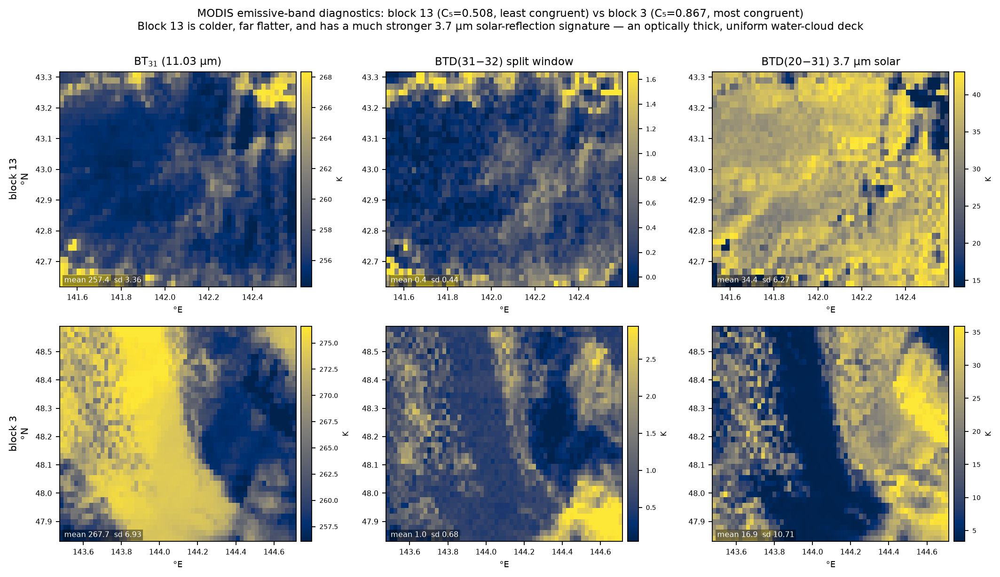

# Terra Fusion 5-sensor discrepancy, part 14: MODIS's own 16 bands explain block 13 — and correct part 13's reading of it

Run on **ares**, 2026-09-29. MOD06/MOD35 were the requested tool; they are not
reachable from this environment, so the question was put to the 16 emissive
bands the granule already carries. They answer it, and they overturn a claim
part 13 made from looking at a picture.

## Headline

* **MOD35/MOD06 are blocked by authentication**, not by absence — see below.
* **Block 13 is under an optically thick, spatially uniform water-cloud deck.**
  BT₃₁ = 257.4 K with sd **3.36 K** (2nd flattest of 32) and BTD(20−31) =
  **+34.4 K**, a strong 3.7 µm solar-reflection signature (rank 30/32).
* **MODIS's own 16 bands disagree there too** — C₁₆ = 0.556, **2nd lowest of
  32**. So block 13's incongruence is a property of the *scene*, not of the
  cross-sensor comparison.
* **Scene contrast explains most of the anomaly the reanalysis could not.**
  Controlling for BT₃₁ contrast drops block 13's residual from part 13's
  **z = −2.81 (rank 1/32)** to **z = −1.43 (rank 4/32)**.
* **Part 13's "terrain-dominated, not a cloud field" caption was WRONG** and is
  corrected there.

## MOD06/MOD35: blocked, not missing

Both granules exist and were located via CMR (an open API, no auth):

```
MOD35_L2.A2001322.0140.061.2017226192229.hdf
MOD06_L2.A2001322.0140.061.2017278095551.hdf
```

`.0140` is the right granule: block 13 is covered **entirely** by MODIS granule
`2001322_0140` (6469 pixels), so a single 5-minute product would have sufficed.

Both download endpoints require Earthdata Login:

| endpoint | result |
| --- | --- |
| `data.laadsdaac.earthdatacloud.nasa.gov` | **HTTP 401** → `urs.earthdata.nasa.gov/oauth/authorize` |
| `ladsweb.modaps.eosdis.nasa.gov/archive/...` | HTTP 200 but **10,831 bytes**, final URL is the OAuth login page — the HTML form, not the ~50 MB HDF |

There is no `~/.netrc`, no `EARTHDATA_TOKEN`, and no local copy anywhere on this
machine. **To finish the MOD35/MOD06 route, an Earthdata token is the one
missing input.** With one, `bin/tf_modis_spectral.py` would be joined by a
direct cloud-mask comparison rather than the proxy below.

## What the 16 bands can do instead

`EV_1KM_Emissive` carries every band MOD35's infrared tests are built on. Each
was converted to brightness temperature with the inverse Planck in wavelength
form, `T = c₂/(λ·ln(1 + c₁/(λ⁵L)))`, on all 963,107 pixels where all 16 bands
are valid. The result is physically sound, which is the first check:

| band | λ µm | BT range K | |
| --- | --- | --- | --- |
| 20 | 3.750 | 257.7 – 323.2 | solar-contaminated by day |
| 29 | 8.550 | 244.2 – 289.2 | |
| 30 | 9.730 | 205.5 – 274.4 | ozone |
| 31 | 11.030 | 245.2 – 292.1 | window |
| 32 | 12.020 | 244.4 – 291.3 | window |
| 35 | 13.935 | 231.7 – 247.8 | CO₂ |
| 36 | 14.235 | 224.6 – 233.0 | deep CO₂ — stratospheric, as it should be |

Band 36 sitting at 225-233 K while band 31 spans 245-292 K is the signature of a
correct radiance-to-BT conversion: the deep CO₂ channel sees only the upper
atmosphere and cannot see the surface at all.

## 1. MODIS disagrees with itself in block 13

The part-12 coherence test, run on MODIS alone: rank-transform all 16 bands on
the block grid, take **C₁₆ = λ₁/16**. One instrument, one footprint, one
geolocation, one resampling — every cross-sensor confound removed.

| blk | C₅ (5 sensors) | **C₁₆ (16 MODIS bands)** | BT₃₁ K | sd K | BTD(31−32) | BTD(20−31) |
| --- | --- | --- | --- | --- | --- | --- |
| **13** | **0.508** *(1/32)* | **0.556** *(2/32)* | 257.4 | **3.36** *(2/32)* | +0.42 | **+34.4** |
| 26 | 0.535 | 0.611 | 285.8 | 3.75 | +0.29 | +9.3 |
| 10 | 0.558 | 0.634 | 252.9 | 3.30 | +0.55 | +36.2 |
| 3 | **0.867** *(32/32)* | 0.656 | 267.7 | **6.93** | +0.95 | +16.9 |

Block 13 is the least congruent block across five instruments **and** the
second-least congruent across one instrument's own sixteen bands. That
combination rules out the cross-sensor machinery — different footprints, radii,
spectral responses, resampling — as the cause. The scene itself is what the
bands disagree about.

Across all 32 blocks the C₁₆↔C₅ correlation is only ρ = +0.279 (p = 0.12), so
this is **not** a general law; it is a statement about block 13, which is an
extreme on both.

## 2. What the scene is

| diagnostic | block 13 | block 3 | reading |
| --- | --- | --- | --- |
| BT₃₁ mean | **257.4 K** | 267.7 K | −16 °C — far too cold for clear land at 43°N in November |
| BT₃₁ sd | **3.36 K** | 6.93 K | almost no thermal contrast |
| BTD(31−32) | +0.42 | +0.95 | small split-window → opaque, not thin cirrus |
| **BTD(20−31)** | **+34.4 K** | +16.9 K | **strong 3.7 µm solar reflection** |

The last row is the discriminator. At 10:32 local solar time a **water cloud
reflects sunlight at 3.75 µm**, inflating its apparent BT far above the 11 µm
value; **snow is dark at 3.7 µm** and gives a small difference. Block 13's
+34.4 K (rank 30/32) is a water-cloud signature. Snow-covered mountains would
have shown the opposite.

So block 13 is a **cold, optically thick, spatially uniform water-cloud deck** —
and a uniform cloud deck is precisely a scene with nothing for five
radiometers to agree about.



Block 3, for contrast, has a sharp cloud/clear boundary running through it —
visible in all three panels — which every instrument resolves. That is what
C₅ = 0.867 looks like.

## 3. This closes most of part 13's residual

Part 13 found block 13 anomalous against the *synoptic* thermal gradient. Adding
the *radiance* scene contrast:

| model | R² | block 13 residual | rank |
| --- | --- | --- | --- |
| C₅ ~ reanalysis \|∇T\| *(part 13)* | 0.184 | **z = −2.81** | **1 / 32** |
| C₅ ~ BT₃₁ contrast | 0.250 | z = −1.43 | 4 / 32 |
| C₅ ~ split window BTD(31−32) | 0.245 | z = −1.76 | 1 / 32 |
| C₅ ~ contrast + split window | 0.311 | z = −1.44 | 2 / 32 |

**The resolution of part 13's puzzle**: block 13 sits in a strong synoptic
gradient (|∇T| = 1.93 K/100 km) but a uniform cloud deck *hides that gradient
from the radiometers*. Synoptic forcing and radiance contrast are different
quantities, and it is the second one the sensors actually see. Once measured,
block 13 stops being an extreme outlier.

It does not become ordinary — z = −1.43 is still 4th-lowest — so some of its
incongruence remains unaccounted for.

Across all 32 blocks the split-window difference is the single best predictor of
C₅ found so far: **ρ = +0.512, p = 0.0028**, ahead of BT₃₁ contrast (+0.434,
p = 0.013) and well ahead of anything in the reanalysis.

## Correction to part 13

Part 13's caption on the block-13 image read:

> *"The scene is terrain-dominated — cold ridges, warm valleys, the
> Hidaka/Yubari relief of central Hokkaido — not a cloud field."*

**That is wrong.** BT₃₁ = 257.4 K is too cold for a clear land surface there and
then, and BTD(20−31) = +34.4 K is a water-cloud reflection signature. The scene
*is* a cloud field. The ridge-and-valley appearance is cloud-top structure,
plausibly organised by the terrain beneath it — but that organisation is a
hypothesis, not something these data establish.

It is worth naming the error, because it is the same one this series has now
made four times: **reading a picture, or a number, as though the input had been
established.** Parts 10 and 11 caught it in band selection, part 12 in the
loading ordering, and here in a caption written from visual impression. The
16-band evidence was available the whole time.

## Per-band detail

[Part 15](20260929_claude_terra_fusion_discrepancy_15_band_detail.md) opens C₁₆
up band by band for blocks 3 and 13. Two results bear on this part: the
window/CO₂ family's internal coherence drops 0.729 → 0.553 between them while
the water-vapour family rises 0.484 → 0.705 — consistent with block 13's cloud
deck being what bands 27/28 are sensing — and bands 27/36 sit at the noise floor
(sd < 0.7 K, loading ≈ 0), so C₁₆ = λ₁/16 is diluted by channels that cannot
physically participate.

## Caveats

* **This is a proxy, not MOD35.** The band *tests* are MOD35's; its thresholds,
  ancillary surface data, and clear-sky restoral logic are not. No cloud mask is
  claimed — only that the emissive-band evidence points one way.
* Cloud *phase* is not determined. "Water cloud" follows from the 3.7 µm
  reflection; a mixed-phase top is not excluded.
* Whether the cloud structure is orographically forced is **untested**, as
  above.
* BTD(20−31) also responds to surface type and view geometry in clear scenes;
  it is used here comparatively across blocks on one orbit, which is the case it
  is safe for.
* C₁₆ and C₅ are computed on different band sets and are not directly
  comparable in magnitude — only their *ranks across blocks* are used.
* The heterogeneity metric (local BT₃₁ sd) correlates with C₅ at ρ = −0.117
  (p = 0.53) and explains nothing; it is reported for completeness.
* One orbit, as throughout parts 10-14.

## Reproducing

```sh
PY=~/src/hyoklee/ares/.venv-tf/bin/python3
$PY bin/tf_modis_spectral.py           # -> modis_spectral.json, 32 blocks, ~4 min
TF_BLKS=13,3 $PY bin/tf_modis_spectral.py   # just the two compared here
```

Needs `aster_blocks.json`. The figure is produced by the block-comparison
snippet recorded in the commit for this part.
