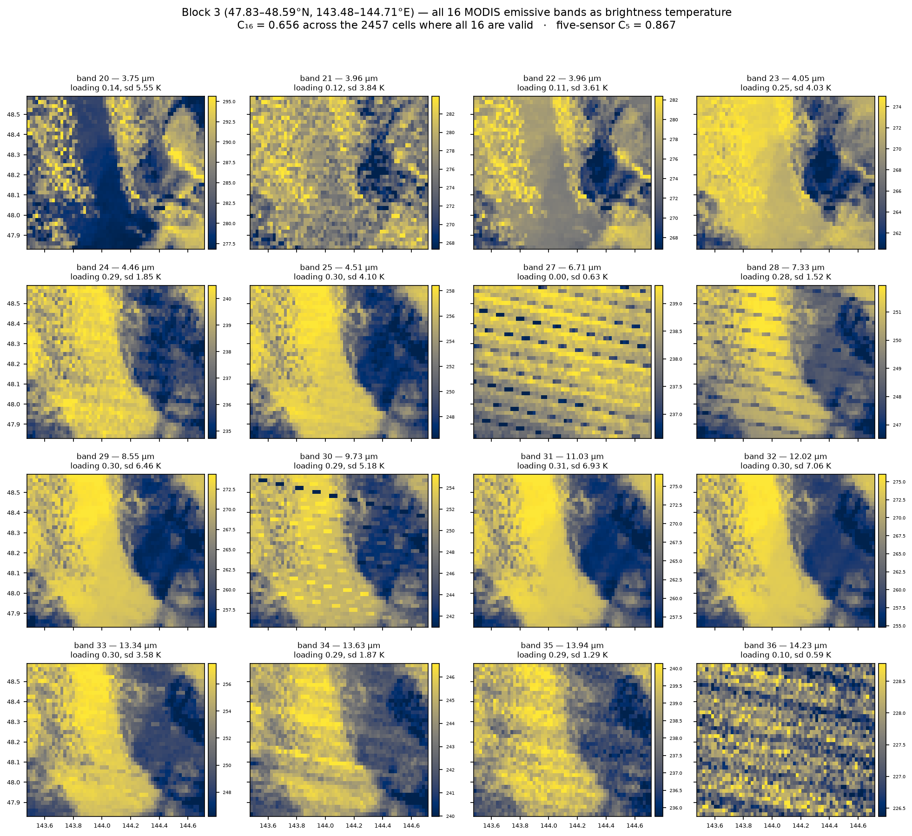
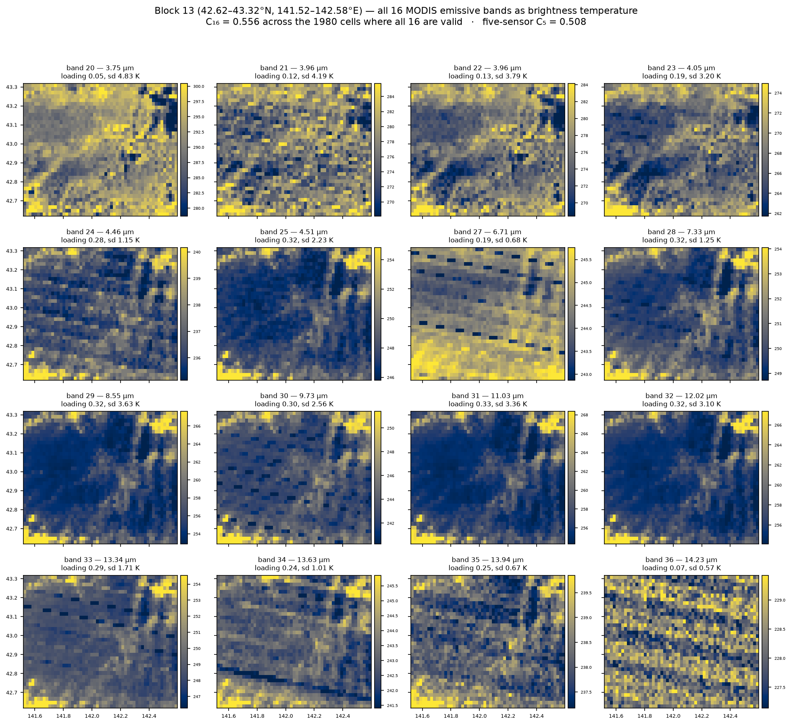

# Terra Fusion 5-sensor discrepancy, part 15: the 16 bands, block by block — the family structure inverts, and C₁₆ is diluted by bands that cannot see

Run on **ares**, 2026-09-29. Part 14 reduced each block to one number,
C₁₆ = λ₁/16, and found block 13 second-lowest of 32. This opens that number up
per band, for **block 3** (most congruent) against **block 13** (least), and the
result is more specific than "block 13 has less contrast".

## Headline

* **The spectral family structure inverts between the two blocks.** Block 3's
  coherence lives in the window/CO₂ bands (mean |ρ| **0.729**) with the
  water-vapour bands loose (0.484). Block 13 is the reverse: window/CO₂ **0.553**,
  water vapour **0.705**.
* **Window-band contrast in block 13 is about half** block 3's — band 31 sd
  3.36 K vs 6.93 K, band 32 3.10 vs 7.06, band 29 3.63 vs 6.46.
* **Bands 27 and 36 are at the noise floor and contribute nothing.** In block 3,
  band 27 (6.71 µm) has sd 0.63 K and loading **0.001** — the image is pure
  detector striping. Band 36 (14.23 µm) is sd 0.59 K, loading 0.099.
* **So C₁₆ = λ₁/16 is structurally diluted**: it divides by 16 when only 13-14
  bands can physically participate. Same defect shape as parts 10-12 — a metric
  penalising a channel for not seeing something it cannot see.
* Detector striping is plainly visible in the low-contrast bands (27, 30, 33,
  34), and it is most obvious exactly where scene contrast is lowest.

## Block 3 — coherence concentrated in the window



C₁₆ = 0.656 over 2457 cells, five-sensor C₅ = 0.867.

| band | λ µm | family | BT mean K | sd K | loading | sign |
| --- | --- | --- | --- | --- | --- | --- |
| 20 | 3.750 | solar | 284.6 | 5.55 | 0.144 | **+1** |
| 21 | 3.959 | solar | 277.0 | 3.84 | 0.116 | −1 |
| 22 | 3.959 | solar | 276.0 | 3.61 | 0.112 | −1 |
| 23 | 4.050 | solar | 270.2 | 4.03 | 0.254 | −1 |
| 24 | 4.465 | solar | 238.1 | 1.85 | 0.294 | −1 |
| 25 | 4.515 | solar | 253.4 | 4.10 | 0.303 | −1 |
| **27** | 6.715 | wv | 238.5 | **0.63** | **0.001** | +1 |
| 28 | 7.325 | wv | 249.5 | 1.52 | 0.280 | −1 |
| 29 | 8.550 | window | 266.3 | 6.46 | 0.304 | −1 |
| 30 | 9.730 | ozone | 248.9 | 5.18 | 0.292 | −1 |
| 31 | 11.030 | window | 267.7 | **6.93** | **0.305** | −1 |
| 32 | 12.020 | window | 266.7 | **7.06** | **0.305** | −1 |
| 33 | 13.335 | CO₂ | 252.7 | 3.58 | 0.300 | −1 |
| 34 | 13.635 | CO₂ | 243.7 | 1.87 | 0.291 | −1 |
| 35 | 13.935 | CO₂ | 238.3 | 1.29 | 0.289 | −1 |
| **36** | 14.235 | CO₂ | 227.6 | **0.59** | 0.099 | −1 |

Ten bands load between 0.28 and 0.31 — they are all seeing **one sharp
cloud/clear boundary** that runs north-south through the block, and it is
visible as the same feature in every one of their panels. That single
high-amplitude structure is what C₅ = 0.867 is made of.

Band 20 is the only band with a **flipped sign**: at 3.75 µm the cloud
*reflects* sunlight, so it is bright where the thermal bands are cold.

## Block 13 — coherence moves to the water vapour bands



C₁₆ = 0.556 over 1980 cells, five-sensor C₅ = 0.508.

| band | λ µm | family | BT mean K | sd K | loading |
| --- | --- | --- | --- | --- | --- |
| 20 | 3.750 | solar | **291.7** | 4.83 | **0.051** |
| 21 | 3.959 | solar | 277.2 | 4.19 | 0.117 |
| 22 | 3.959 | solar | 276.0 | 3.79 | 0.131 |
| 23 | 4.050 | solar | 267.5 | 3.20 | 0.194 |
| 24 | 4.465 | solar | 236.9 | 1.15 | 0.275 |
| 25 | 4.515 | solar | 248.2 | 2.23 | 0.319 |
| 27 | 6.715 | wv | 244.6 | 0.68 | **0.194** |
| 28 | 7.325 | wv | 250.5 | 1.25 | **0.317** |
| 29 | 8.550 | window | 256.2 | **3.63** | 0.324 |
| 30 | 9.730 | ozone | 243.8 | 2.56 | 0.302 |
| 31 | 11.030 | window | 257.4 | **3.36** | 0.326 |
| 32 | 12.020 | window | 256.9 | **3.10** | 0.322 |
| 33 | 13.335 | CO₂ | 249.1 | 1.71 | 0.293 |
| 34 | 13.635 | CO₂ | 243.1 | 1.01 | 0.237 |
| 35 | 13.935 | CO₂ | 238.2 | 0.67 | 0.248 |
| 36 | 14.235 | CO₂ | 228.3 | 0.57 | 0.066 |

Every panel shows the same diffuse, mottled cloud-top texture. **No band
contains a sharp feature.** Band 20 at 291.7 K is the hottest field in either
block — the 3.7 µm solar reflection off the cloud top from part 14 — and it is
the most decoupled band in the block at loading 0.051.

## The inversion

Mean |ρ| within and between the three spectral families:

**Block 3** (congruent)

| | window/CO₂ | solar | wv |
| --- | --- | --- | --- |
| **window/CO₂** | **0.729** | 0.538 | 0.609 |
| solar | 0.538 | 0.538 | 0.477 |
| wv | 0.609 | 0.477 | 0.484 |

**Block 13** (incongruent)

| | window/CO₂ | solar | wv |
| --- | --- | --- | --- |
| **window/CO₂** | **0.553** | 0.323 | 0.612 |
| solar | 0.323 | 0.513 | 0.407 |
| wv | 0.612 | 0.407 | **0.705** |

The window/CO₂ family — the bands that see the surface or cloud top — goes from
**0.729 to 0.553**, while the water-vapour family goes the other way, **0.484 to
0.705**.

A reading consistent with part 14's cloud-deck finding: in block 13 the deck is
thick and high enough that bands 27 and 28 are sensing **the cloud top rather
than clear-sky mid-tropospheric moisture**, so they track each other closely. In
block 3 the water-vapour bands mostly see clear-sky moisture, decoupled from the
cloud boundary the window bands are locked onto. **This is an interpretation of
the correlation structure, not a retrieval**, and no radiative transfer was run
to test it.

## The metric is diluted by bands that cannot participate

Band 27 in block 3 is the clean case: **sd 0.63 K, loading 0.001**, and its
panel is nothing but detector striping. The 6.7 µm channel sounds the upper
troposphere, which over a 70 km block is essentially uniform — there is no
signal for it to share. Band 36 at 14.23 µm is the same story one step higher.

| block | bands with sd < 0.75 K | their loadings | mean loading, live bands |
| --- | --- | --- | --- |
| 3 | 27, 36 | 0.001, 0.099 | 0.256 (14 bands) |
| 13 | 27, 35, 36 | 0.194, 0.248, 0.066 | 0.247 (13 bands) |

C₁₆ = λ₁/16 divides by the full band count regardless. With two to three bands
structurally unable to contribute, the statistic is depressed by roughly the
same amount everywhere — which is why it still *ranks* blocks usefully, but its
absolute value understates the coherence of the bands that can actually see.

**This is the same defect this series keeps finding**: parts 10 and 11 caught a
metric penalising sensors for a mis-specified band, part 12 caught it ordering
sensors by spectral similarity and being read as anomaly detection, and here it
is penalising channels for lacking a signal they are not built to receive. The
family-level correlations above are the more honest summary, which is why they
are the table to read.

Note the live-band mean loadings are nearly identical (0.256 vs 0.247) while the
*spread* is not (0.194 vs 0.275): block 13's bands are not uniformly worse, they
are more unequal.

## Instrument artifact, visible

Striping appears in bands 27, 30, 33 and 34 in both blocks — MODIS's
detector-to-detector calibration differences within its 10-detector scan. It is
not new, and it is not what makes block 13 incongruent (it is present in block 3
too). It matters here only because **it becomes the dominant visible structure
once the scene contrast drops below about 1 K**, which is precisely the regime
bands 27/35/36 are in. It is a reminder that a low-contrast band's "pattern" may
be the instrument rather than the atmosphere.

## Caveats

* Two blocks of 32. The family inversion is measured on block 3 and block 13
  only; whether it generalises across the ranking was **not** tested.
* The water-vapour interpretation is a reading of correlation structure. No
  radiative transfer, no cloud-top pressure retrieval, no MOD06 — which remains
  blocked on an Earthdata token (part 14).
* Bands 21 and 22 share a central wavelength (21 is the high-gain fire channel);
  they are kept separate here and their near-identical loadings reflect that.
* Loadings are absolute values of the leading eigenvector after sign alignment,
  so they measure participation, not direction.
* `C₁₆` was not recomputed on a restricted band set — the dilution is argued
  from the per-band loadings and standard deviations, not from a re-run.
* One orbit, one overpass, as throughout parts 10-15.

## Reproducing

```sh
PY=~/src/hyoklee/ares/.venv-tf/bin/python3
TF_BLK=3  TF_OUT=png $PY bin/tf_modis_band_detail.py
TF_BLK=13 TF_OUT=png $PY bin/tf_modis_band_detail.py
```

Writes `modis_band_detail_blk<N>.json` and `tf_blk<N>_16band.png`. Needs
`aster_blocks.json` and `congruence_b31_WN.json`. About 40 s per block.
